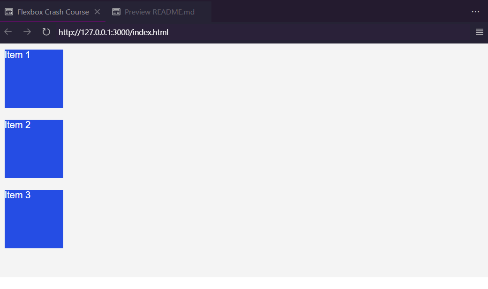

# Flexbox Crash Course 

My notes in this course what I've learned from Youtube. Here's the flexbox model for this course notes.

When elements are laid out as flex items, they are laid out along two axes:

<figure>
    
    <figcaption>Source: https://developer.mozilla.org/en-US/docs/Learn/CSS/CSS_layout/Flexbox/flex_terms.png</figcaption>
</figure>

## Introduction

One-dimensional layout models like the Flexbox Model give a way to distribute space and have strong alignment capabilities.

- **floats** and **tables** were used to align items prior to the use of flexbox. For those that use CSS, Flexbox has greatly simplified their lives.

- An additional choice for alignment, positioning, etc. is `CSS Grid`.

The `flex container` is the element that holds `flex items`. Flex items are **direct children** of flex containers. A container is created with *`display:flex`*

```
<div class="flex-container">
    <div class="item">Item 1</div>
    <div class="item">Item 2</div>
    <div class="item">Item 3</div>
</div>
```

The list of Flex container properties using Flexbox:

1. display: `flex`
2. flex-direction: `row|row-reverse|column|column-reverse`
3. flex-wrap: `nowrap|wrap|wrap-reverse`
4. flex-flow (**shorthand purposes**)
5. justify-content: `flex-start|flex-end|center|space-between|space-around|space-evenly`
6. align-items: `stretch|flex-start|flex-end|center|baseline`
7. align-content: `stretch|flex-start|flex-end|center|space-between|space-around|space-evenly`
8. gap: (set the value in `px` or depends)

The list of Flex item properties using Flexbox:

1. order: `0 (default)`
2. flex-grow: `0 (default)`
3. flex-shrink: `1 (default)`
4. flex-basis: `auto (default)`
5. flex (**shorthand purpose**)
6. align-self: `auto|flex-start|flex-end|center|baseline|stretch`
7. margin: `auto`

## The Axes  

The **main axis** and the **cross axis** are the two primary axes in Flexbox that control how flex elements are arranged and aligned inside a flex container. It is essential to comprehend these axes in order to use Flexbox parameters to control element spacing and positioning.


<figure>
    
    <figcaption>Source: https://www.youtube.com/watch?v=3YW65K6LcIA (4:03) </figcaption>
</figure>

## Setup HTML CSS file

### Create the code in HTML File

Here's the first code for this course

```
<!DOCTYPE html>
<html lang="en">
<head>
    <meta charset="UTF-8">
    <meta name="viewport" content="width=device-width, initial-scale=1.0">
    <title>Flexbox Crash Course</title>
    <link rel="stylesheet" href="style.css">
</head>
<body>
    <div class="flex-container">
        <div class="item">Item 1</div>
        <div class="item">Item 2</div>
        <div class="item">Item 3</div>
    </div>
</body>
</html>
```

<figure>
    
    <figcaption>Here's the HTML Structure for the project</figcaption>
</figure>


### Create the code in CSS File

Here's the code in CSS for this course

```
* {
    margin: 0;
    padding: 0;
    box-sizing: border-box;
}

body {
    font-family: Arial, Helvetica, sans-serif;
}

.item {
    width: 100px;
    height: 100px;
    background-color: #254de4;
    color: #fff;
    margin: 10px;
}

.flex-container {
    background-color: #f4f4f4;
}
```

<figure>
    
    <figcaption></figcaption>
</figure>


## Flex Container

The code for the flexbox for the `.flex-container` selector. This CSS code sets the `display` property of an element to flex. When an element has `display: flex`, it becomes a flex container, which allows you to easily create flexible and responsive layouts.

```
.flex-container {
    background-color: #f4f4f4;
    display: flex; // new code!
}
```

<figure>
    
    <figcaption></figcaption>
</figure>

Several properties are populated with their default settings when you set `display: flex` (or `display: inline-flex`) on a container. Comprehending these default values facilitates forecasting the flex container's and its contents' first behavior. The following are the important Flexbox attributes' default values:

### Flex Container Default Properties

1. `flex-direction`
    - Default value: `row`
    - The main axis is horizontal, running from left to right.

2. `flex-wrap`
    - Default value: `nowrap`
    - Flex items are laid out in a single line, and they will not wrap onto multiple lines.

3. `flex-flow`
    - Default value: `row nowrap`
    - A shorthand for `flex-direction` and `flex-wrap`.

4. `justify-content`
    - Default value: `flex-start`
    - Flex items are packed toward the start of the main axis.

5. `align-items`
    - Default value: `stretch`
    - Flex items are stretched to fill the container along the cross axis.

6. `align-content`
    - Default value: `stretch`
    - Applies when there are multiple lines (i.e., when `flex-wrap` is not `nowrap`). The lines are stretched to take up the remaining space in the container.


### Flex Item Default Properties


1. `order`
    - Default value: `0`
    - The default order is the same as the order in the source code.

2. `flex-grow`
    - Default value: `0`
    - Flex items do not grow to fill the available space by default.

3. `flex-shrink`
    - Default value: `1`
    - Flex items are allowed to shrink to fit the container.

4. `flex-basis`
    - Default value: `auto`
    - The initial main size of the flex item is based on its content or specified size.

5. `flex`
    - Default value: `0 1 auto`
    - A shorthand for setting `flex-grow`, `flex-shrink`, and `flex-basis`.

6. `align-self`
    - Default value: `auto`
    - Flex items align themselves based on the value of `align-items` set on their parent container, unless overridden.


## The `float` Example (without Flex)

Layouting with floats was a popular method before Flexbox and CSS Grid appeared. Even though Flexbox offers more reliable and user-friendly layout options for contemporary designs, knowing how to accomplish the same goals with floats can be helpful, particularly when working on older projects or making sure legacy systems are compatible.

### Comparison: Floats vs. Flexbox

#### Flexbox Benefits

- **Simple Centering and Alignment**: Centering and aligning things both horizontally and vertically is made easier using Flexbox.

- Flexbox simplifies the process of creating responsive designs by eliminating the need for media queries to modify the layout.

- **Space Distribution**: Layouts become more flexible with properties like justify-content and align-items, which distribute space dynamically.

#### Float Limitations

- **Manual Clearing**: Floats require manual clearing to avoid layout issues, often using hacks like clearfix.

- **Vertical Alignment**: Achieving vertical alignment with floats is cumbersome and less intuitive.

- **Less Flexibility**: Floats are less flexible for complex layouts, especially when compared to Flexbox’s dynamic space distribution.

Now, let's change the code for CSS File of Flex Course. Remove or comment the `display: flex`. Then, use `float` CSS property.

```
* {
    margin: 0;
    padding: 0;
    box-sizing: border-box;
}

body {
    font-family: Arial, Helvetica, sans-serif;
}

.item {
    width: 100px;
    height: 100px;
    background-color: #254de4;
    color: #fff;
    margin: 10px;
    float: left;
}

.flex-container {
    background-color: #f4f4f4;
}
```

<figure>
    
    <figcaption></figcaption>
</figure>

Add another element for the project `float` and see the result.

```
<!DOCTYPE html>
<html lang="en">
<head>
    <!-- snip -->
</head>
<body>
    <div class="flex-container">
        <div class="item">Item 1</div>
        <div class="item">Item 2</div>
        <div class="item">Item 3</div>
    </div>
    <h1>Hello World</h1>
</body>
</html>
```

<figure>
    
    <figcaption></figcaption>
</figure>

This CSS code is targeting the `::after` pseudo-element of the `.flex-container` class. It sets the `content` property to an empty string, which means there will be no visible content inside the element. The `clear` property is set to `both`, which means it will clear floats on both sides of the element. The display property is set to block, which means the pseudo-element will be displayed as a block-level element. This is commonly used to clear floats and create a new block formatting context.

```
.flex-container::after{
    content: "";
    clear: both;
    display: block;
}
```

<figure>
    
    <figcaption>Here's the element of `h1` goes down under the `container`</figcaption>
</figure>

## The `justify-content` Property

Flexbox's `justify-content` attribute is used to align flex elements with the flex container's main axis. This feature is very helpful for managing how items are arranged within the container and how far apart they are from one another.

### The `justify-content: flex-start`

The line of code `justify-content: flex-start;` is a CSS property that is used in conjunction with the `display: flex;` property. It is used to align the flex items along the main axis of the flex container. In this case, `flex-start` means that the flex items will be aligned to the start of the main axis.

```
.flex-container {
    background-color: #f4f4f4;
    display: flex;
    justify-content: flex-start;
}
```

<figure>
    
    <figcaption></figcaption>
</figure>

### The `justify-content: flex-end`

The `justify-content: flex-end;` CSS property is used to align flex items along the main axis of a flex container. In this case, it will align the flex items to the end of the flex container.

```
.flex-container {
    background-color: #f4f4f4;
    display: flex;
    justify-content: flex-end;
}
```

<figure>
    
    <figcaption>Those items are align top-right.</figcaption>
</figure>

### The `justify-content: center`

The `justify-content: center;` CSS property is used to horizontally center the flex items within a flex container. It aligns the flex items along the main axis of the flex container. In this case, it centers the `.item` elements horizontally within the `.flex-container` element.

<figure>
    
    <figcaption></figcaption>
</figure>

### The `justify-content: space-between`

The `justify-content: space-between;` CSS property is used to evenly distribute flex items along the main axis of a flex container. It creates space between the flex items, but does not distribute the space evenly between the start and end of the container. The first item is placed at the start of the container, the last item is placed at the end of the container, and the remaining items are distributed with equal space between them.

```
.flex-container {
    background-color: #f4f4f4;
    display: flex;
    justify-content: space-between;
}
```

<figure>
    
    <figcaption></figcaption>
</figure>

### The `justify-content: space-around;`

This CSS property `justify-content: space-around;` is used to distribute the flex items with equal space around them. The space is distributed evenly between the flex items, pushing them away from each other. The first item is placed at the start of the container, the last item is placed at the end of the container, and the remaining items are distributed with equal space between them.

<figure>
    
    <figcaption></figcaption>
</figure>

### The `justify-content: space-evenly;`

This CSS property `justify-content: space-evenly;` is used to distribute the flex items with equal space around them, including the space before the first item and after the last item. The space is distributed evenly between the flex items, pushing them away from each other.

<figure>
    
    <figcaption></figcaption>
</figure>

## The `align-items` Property


The `align-items` property in Flexbox is used to align flex items along the cross axis of the flex container. This property helps to control the alignment of items when they are laid out within the flex container, providing various options to position them relative to each other.

Adjust the size of of height for the `container`. This CSS code sets the `height` of an element to `400 pixels`.

<figure>
    
    <figcaption></figcaption>
</figure>

### The `align-items: stretch;`

This CSS property `align-items: stretch;` is used in a flex container. It stretches the flex items to fill the container along the cross axis. In other words, it makes the flex items take up the full height of the container if the flex container is a row, or the full width of the container if the flex container is a column.

- Flex items are stretched to fill the container along the cross axis.

- Example: In a row layout, items stretch to fill the container's height.

```
.flex-container {
    background-color: #f4f4f4;
    display: flex;
    justify-content: space-evenly;
    height: 400px;
    align-items: stretch;
}
```

<figure>
    
    <figcaption></figcaption>
</figure>

### The `align-items: flex-start;`

This CSS code sets the alignment of flex items along the cross axis of their container. The value `flex-start` means that the flex items will be aligned to the start of the cross axis.

- Flex items are aligned to the start of the cross axis.
- Example: In a row layout, items align to the top of the container.

```
.flex-container {
    background-color: #f4f4f4;
    display: flex;
    justify-content: space-evenly;
    height: 400px;
    align-items: flex-start;
}
```

<figure>
    
    <figcaption></figcaption>
</figure>

### The `align-items: flex-end;`

The `align-items: flex-end;` property in Flexbox is used to align flex items along the cross axis of the flex container, positioning them at the end of the container's cross axis. This means that, depending on the `flex-direction` of the container, the items will be aligned at the bottom if the flex direction is row (horizontal) or to the right if the flex direction is column (vertical).

```

.flex-container {
    background-color: #f4f4f4;
    display: flex;
    justify-content: space-evenly;
    height: 400px;
    align-items: flex-end;
}
```

<figure>
    
    <figcaption></figcaption>
</figure>

### The `align-items: center;`

This CSS code sets the alignment of items within a container to be centered vertically. The `align-items: center;` property is commonly used in Flexbox layouts.

```
.flex-container {
    background-color: #f4f4f4;
    display: flex;
    justify-content: space-evenly;
    height: 400px;
    align-items: center;
}
```

<figure>
    
    <figcaption></figcaption>
</figure>

### The `align-items: baseline;`

The CSS property `align-items: baseline;` is used in flexbox layouts to align flex items along their baselines. In this case, it means that the flex items will be aligned with their baselines, which are the bottom of the text content.

```
.flex-container {
    background-color: #f4f4f4;
    display: flex;
    justify-content: space-evenly;
    height: 400px;
    align-items: baseline;
}
```

<figure>
    
    <figcaption></figcaption>
</figure>

## The `align-self` CSS Property


The `align-self` property in Flexbox allows you to override the `align-items` property for individual flex items. This property can be applied to any flex item to change its alignment along the cross axis, providing more granular control over the layout.

### `align-self` Property Values

Here are the values you can use with `align-self`:

1. `auto (default)`
    - The item inherits the `align-items` value from its parent container.
    - If the parent has `align-items: flex-start`, the item will align to the start unless overridden.

2. `flex-start`
    - Aligns the item to the start of the cross axis.
    - Example: In a row layout, aligns the item to the top.

3. `flex-end`

    - Aligns the item to the end of the cross axis.
    - Example: In a row layout, aligns the item to the bottom.

4. `center`

    - Centers the item along the cross axis.
    - Example: In a row layout, centers the item vertically.

5. `baseline`

    - Aligns the item such that its baseline aligns with the baseline of the other items.
    - Useful for aligning text.

6. `stretch`
    - Stretches the item to fill the container along the cross axis.
    - This is the default behavior unless a height or width is set.

Now, align the items by themselves using these code.

```
.item:nth-of-type(3){
    align-self: flex-end;
}

.item:nth-of-type(2){
    align-self: center;
}

.item:nth-of-type(1){
    align-self: flex-start;
}
```

This CSS code  is using the `:nth-of-type()` selector to target specific elements with the class name "item".

- `.item:nth-of-type(3)` targets the third element with the class name "item" and sets its alignment to flex-end.

- `.item:nth-of-type(2)` targets the second element with the class name "item" and sets its alignment to center.

- `.item:nth-of-type(1)` targets the first element with the class name "item" and sets its alignment to flex-start.

<figure>
    
    <figcaption></figcaption>
</figure>

## The Flex Direction

The direction in which the flex container's children (flex items) are positioned inside the flex container is specified by the CSS `flex-direction` property. This characteristic is essential for identifying the container's main axis, which in turn influences the alignment and arrangement of the flex components.

## The `flex-direction: row (default)`

The `flex-direction: row;` CSS property sets the direction of the flexible items in a flex container. In this case, it specifies that the items should be laid out in a row, from left to right.

```
.flex-container {
    background-color: #f4f4f4;
    flex-direction: row;
    display: flex;
    justify-content: flex-start;
    height: 400px;
    align-items: flex-start;
}
```

<figure>
    
    <figcaption></figcaption>
</figure>

## The `flex-direction: row-reverse`

The `flex-direction` property in CSS is used to specify the direction of the flexible items within a flex container. In the provided code snippet, `flex-direction: row-reverse` is applied to the .flex-container class. This means that the flexible items within the .`flex-container` will be laid out in a row direction, but in reverse order compared to the default direction.

```
.flex-container {
    background-color: #f4f4f4;
    flex-direction:  row-reverse;
    display: flex;
    justify-content: flex-start;
    height: 400px;
    align-items: flex-start;
}
```

<figure>
    
    <figcaption></figcaption>
</figure>

## The `flex-direction: column`

The `flex-direction: column;` CSS property is used to specify the direction of the flexible items within a flex container. In this case, the flexible items will be laid out in a column direction, from top to bottom.

```
.flex-container {
    background-color: #f4f4f4;
    flex-direction: column;
    display: flex;
    justify-content: flex-start;
    height: 400px;
    align-items: flex-start;
}
```

<figure>
    
    <figcaption></figcaption>
</figure>

## The `flex-direction: column-reverse;`

The `flex-direction: column-reverse;` CSS property is used to specify the direction of the flexible items in a flex container. In this case, it sets the direction to be in a column direction, but reverses the order of the items. The items will be stacked vertically from bottom to top.

```
.flex-container {
    background-color: #f4f4f4;
    flex-direction: column-reverse;
    display: flex;
    justify-content: flex-start;
    height: 400px;
    align-items: flex-start;
}
```

<figure>
    
    <figcaption></figcaption>
</figure>

## Alignmet of Content of Items

Now set the flex for the `.item` class.

```
.item {
    width: 100px;
    height: 100px;
    background-color: #254de4;
    color: #fff;
    margin: 10px;
    display: flex;
}
```

Use `justify-content` property to set the `center` for main-axis.

```
.item {
    width: 100px;
    height: 100px;
    background-color: #254de4;
    color: #fff;
    margin: 10px;
    display: flex;
    justify-content: center;
}
```

<figure>
    
    <figcaption></figcaption>
</figure>

Use `align-items` CSS property to set the `center` for main-axis.

```
.item {
    width: 100px;
    height: 100px;
    background-color: #254de4;
    color: #fff;
    margin: 10px;
    display: flex;
    justify-content: center;
    align-items: center;
}
```

<figure>
    
    <figcaption></figcaption>
</figure>

## The `flex-wrap` CSS Property

The CSS `flex-wrap` property can be used to construct a flexbox container that encloses its child elements.

### The `flex-wrap: nowrap`

The CSS property `flex-wrap: nowrap;` is used in the **.flex-container** class in the `style.css` file. It specifies that the flex items should not wrap onto multiple lines. Instead, they will overflow the container horizontally.

```
.flex-container {
    background-color: #f4f4f4;
    flex-direction: row;
    display: flex;
    justify-content: flex-start;
    align-items: flex-start;
    flex-wrap: nowrap;
}
```

<figure>
    
    <figcaption></figcaption>
</figure>

### The `flex-wrap: wrap`

The CSS property `flex-wrap: wrap;` is used in conjunction with the `display: flex;` property to enable wrapping of flex items. When the flex container is too small to accommodate all the flex items, the items will wrap onto the next line. This is useful for creating responsive layouts.

```
.flex-container {
    background-color: #f4f4f4;
    flex-direction: row;
    display: flex;
    justify-content: flex-start;
    align-items: flex-start;
    flex-wrap: wrap;
}
```

<figure>
    
    <figcaption></figcaption>
</figure>

### The `flex-wrap: wrap-reverse`

The `flex-wrap: wrap-reverse;` CSS property is used to reverse the direction of flex items when they wrap onto multiple lines. By default, flex items will wrap in the normal direction (from top to bottom or left to right). However, with `flex-wrap: wrap-reverse;`, the items will wrap in the opposite direction, starting from the bottom or right.

```
.flex-container {
    background-color: #f4f4f4;
    flex-direction: row;
    display: flex;
    justify-content: flex-start;
    align-items: flex-start;
    flex-wrap: wrap-reverse;
}
```

<figure>
    
    <figcaption></figcaption>
</figure>

## The `order` CSS Property

The `order` property in CSS is used in Flexbox and Grid layouts to control the order in which flex or grid items are displayed within their container. By default, items are displayed in the order they appear in the source code, but the `order` property allows you to override this default order and reorder items without changing the HTML structure.

### Syntax

```
.item {
  order: <integer>;
}
```

### Values
`<integer>`: Specifies the order of the flex or grid item. The default value is `0`. Items with lower order values are displayed first. Negative values are allowed and will position items before those with positive values.

This CSS code is using the `:nth-of-type` pseudo-class to select specific elements with the class name "item".

- The first rule selects the first element with the class **"item"** and sets its `order` property to 2.

- The second rule selects the second element with the class **"item"** and sets its `order` property to 1.

- The third rule selects the third element with the class **"item"** and sets its `order` property to 3.

The `order` property specifies the order in which flex items appear in their container. Elements with a higher order value will appear later in the flex container, while elements with lower order values will appear earlier.

```
.item:nth-of-type(1){
    order: 2;
}

.item:nth-of-type(2){
    order: 1;
}

.item:nth-of-type(3){
    order: 3;
}
```

### Before

<figure>
    
    <figcaption></figcaption>
</figure>

### After with using `order`

<figure>
    
    <figcaption></figcaption>
</figure>

The `flex-basis` property in CSS Flexbox is used to set the initial main size of a flex item before any remaining space is distributed according to the flex-grow and flex-shrink properties. It specifies the ideal size of the flex item along the main axis, which is determined by the flex container's flex-direction.

### Syntax 

```
.item {
  flex-basis: <length> | auto;
}
```

These CSS rules are setting the initial width of each .`item` element based on its position in the document.

- The first `.item` element will have a width of `55px`.
- The second `.item` element will have a width of `300px`.
- The third `.item` element will have a width of `200px`.

The `:nth-of-type(n)` pseudo-class selects elements of a given type that are the nth child of their parent, counting from 1. In this case, the `:nth-of-type(1)` selector targets the first `.item` element, `:nth-of-type(2)` targets the second, and `:nth-of-type(3)` targets the third.

The flex-basis property sets the initial main size of a flex item. In this case, it's setting the initial width of the `.item` elements.

```
.item:nth-of-type(1){
    flex-basis: 55px;
}

.item:nth-of-type(2){
    flex-basis: 300px;
}

.item:nth-of-type(3){
    flex-basis: 200px;
}
```

<figure>
    
    <figcaption></figcaption>
</figure>

## The `flex-grow` CSS Property

When there is excess space available, a flex item in CSS Flexbox can grow relative to the other flex items inside the same container by using the `flex-grow` property. It is a component of the flexible box architecture that aids in proportionately allocating the remaining space inside the flex container.

### Syntax

```
.item {
  flex-grow: <number>;
}
```

### Values

- `<number>`: A unitless number that serves as a proportion. It defines the growth factor of the flex item relative to the other flex items. The default value is `0`.

This CSS code is using the `:nth-of-type() `selector to target specific elements with the class name **"item"**. It sets the `flex-grow` property for each `.item` element based on its position in the document.

- The first `.item` element will have a `flex-grow` value of 1.

- The second `.item` element will have a `flex-grow` value of 3.

- The third `.item` element will have a `flex-grow` value of 1.

The `flex-grow` property specifies how much the flex item should grow relative to the other flex items inside the same container. A higher value means the item will grow more than others.

```
.item:nth-of-type(1){
    flex-grow: 1;
}

.item:nth-of-type(2){
    flex-grow: 3;
}

.item:nth-of-type(3){
    flex-grow: 1;
}
```

<figure>
    
    <figcaption></figcaption>
</figure>

## The `flex-shrink` CSS Property

Before we proceed in this CSS property in Flexbox, make sure the `flex-wrap` in this activity was removed.

### Before:

<figure>
    
    <figcaption></figcaption>
</figure>

The `flex-shrink` property in CSS Flexbox is used to specify how much a flex item should shrink relative to the rest of the flex items inside the same container when there is not enough space available. It helps in distributing the negative space proportionally among flex items, ensuring they shrink correctly to fit within the flex container.

### Syntax

```
.item {
  flex-shrink: <number>;
}
```

### Values
`<number>`: A unitless number that serves as a proportion. It defines the shrink factor of the flex item relative to the other flex items. The default value is `1`.

Here's the code. This CSS code is targeting the `.item` elements based on their position in the document. The `:nth-of-type(n)` pseudo-class selector is used to select elements based on their position among a group of siblings.

In this case, the .item elements with the index of 1, 2, and 3 are being targeted. The flex-shrink property is being set to different values for each element: 1, 2, and 3 respectively.

The flex-shrink property specifies the flex shrink factor, which determines how much the flex items will shrink relative to the rest of the flex items in the container when there is not enough space. A higher value means the item will shrink more than items with lower values.

So, in this code snippet, the first .item element will shrink more than the second and third elements when there is not enough space in the flex container.

```
.item:nth-of-type(1){
    flex-shrink: 1;
}

.item:nth-of-type(2){
    flex-shrink: 2;
}

.item:nth-of-type(3){
    flex-shrink: 3;
}
```

### After:

<figure>
    
    <figcaption></figcaption>
</figure>

## The `flex` CSS Property

Before, we start, should remove the `flex-basis`, the `width`, and the `flex-shrink` Properties for this topic using `flex`. The project you create as a part of this course should like this in the browser.

<figure>
    
    <figcaption></figcaption>
</figure>

The `flex` property in CSS is a shorthand for the three main flexbox properties: `flex-grow`, `flex-shrink`, and `flex-basis`. This property is used to define how a flex item will grow, shrink, and what its initial size will be within a flex container.

### Syntax

```
.item {
  flex: none | [ <'flex-grow'> <'flex-shrink'>? || <'flex-basis'> ]
}
```

### Values
- `none`: Equivalent to `flex: 0 0 auto;` which means no growth, no shrinkage, and the flex-basis is determined by the content or specified width/height.

- `auto`: Equivalent to `flex: 1 1 auto;` which allows the item to grow and shrink as needed, with the initial size being determined by the content or specified width/height.

- `<flex-grow>`: A unitless number that specifies the flex item’s ability to grow if necessary.

- `<flex-shrink>`: A unitless number that specifies the flex item’s ability to shrink if necessary.
- `<flex-basis>`: Specifies the initial size of the flex item before space distribution. Can be a length (e.g., `px`, `em`, etc.), a `percentage`, or the keyword `auto`.

This CSS rule is setting the flex properties of an element.

- `flex: 1 0 100px;`
    - `1` is the flex-grow factor, which determines how much the element should grow relative to the rest of the flex items. In this case, it will grow to fill any available space.

    - `0` is the flex-shrink factor, which determines how much the element should shrink relative to the rest of the flex items. In this case, it will not shrink at all.

    - `100px` is the flex-basis, which specifies the initial size of the element before the remaining space is distributed. In this case, the element will be initially set to a width of 100 pixels.

```
.item {
    flex: 1 0 100px;
    height: 100px;
    background-color: #254de4;
    color: #fff;
    margin: 10px;
    display: flex;
    justify-content: center;
    align-items: center;
}
```

<figure>
    
    <figcaption></figcaption>
</figure>

How about adding another three `.item` element for this project and see what will happen. Then, apply the `wrap` for `flex-container` class for `div`

#### HTML 5

```
<!DOCTYPE html>
<html lang="en">
    <head>
        <!-- snip -->
    </head>
    <body>
        <div class="flex-container">
            <div class="item">Item 1</div>
            <div class="item">Item 2</div>
            <div class="item">Item 3</div>
            <div class="item">Item 4</div>
            <div class="item">Item 5</div>
            <div class="item">Item 6</div>
        </div>
    </body>
</html>
```

#### CSS

```
.flex-container {
    background-color: #f4f4f4;
    flex-direction: row;
    display: flex;
    justify-content: flex-start;
    align-items: flex-start;
    flex-wrap: wrap;
}
```

<figure>
    
    <figcaption></figcaption>
</figure>

After you study this, create the project!
